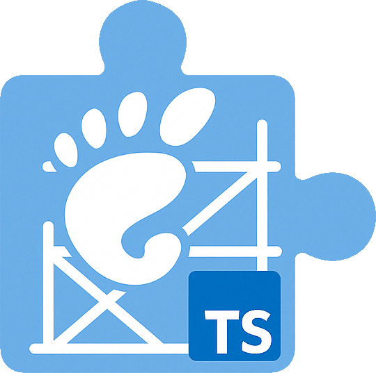

# gnome-ext

<div align="center">
  
  
  <p>Modern scaffolding and build tools for GNOME Shell extensions in TypeScript.</p>
  
  <p>
    <a href="https://www.npmjs.com/package/gnome-ext">
      
    </a>
    <a href="https://opensource.org/licenses/MIT">
      
    </a>
  </p>
</div>

## Overview

`gnome-ext` is a CLI tool that simplifies the development of GNOME Shell extensions using TypeScript. It provides scaffolding, building, and development utilities designed for the modern GNOME Shell (45+) with ES modules support.

```bash
npm install -g gnome-ext
```

## Features

- 🏗️ **Simplified Scaffolding**: Create new extension projects with best practices built in
- 📦 **TypeScript Support**: First-class TypeScript integration with GNOME Shell typings
- 🧪 **Development Environment**: Integrated development mode with nested GNOME Shell
- ⚡ **Modern ES Modules**: Built for GNOME Shell 45+ with ES modules support
- 🎨 **Multiple Templates**: Choose basic or indicator templates for quick starts

## Requirements

- Node.js 18+ 
- npm 8+
- GNOME Shell 45+
- `gnome-extensions` CLI tool
- `dbus-run-session` for development mode

## Installation

Install globally via npm:

```bash
npm install -g gnome-ext
```

## Usage

### Creating a New Extension

```bash
gnome-ext create my-extension
```

This will prompt for extension details and create a directory with a fully functional extension template.

### Available Templates

- **basic**: Minimal extension with enable/disable methods
- **indicator**: Extension with panel icon and popup menu

### Building the Extension

```bash
cd my-extension
gnome-ext build
```

### Packaging for Installation

```bash
gnome-ext pack
```

### Installing Locally

```bash
gnome-ext install
```

### Development Environment

Launch a nested GNOME Shell with your extension for testing:

```bash
gnome-ext dev
```

Options:
- `--resolution`: Set display resolution (default: 1920x1080)
- `--watch`: Enable file watching for automatic rebuilds
- `--monitors`: Set number of monitors in nested shell

## Project Structure

The generated extension project follows this structure:

```
my-extension/
├── src/
│   ├── extension.ts        # Main extension entry point
│   ├── metadata.json       # Extension metadata
│   └── lib/                # Core functionality
├── scripts/
│   ├── build.sh            # Build script
│   ├── pack.sh             # Packaging script
│   ├── install.sh          # Local installation
│   └── dev.sh              # Development environment
├── assets/                 # Icons, etc.
├── package.json            # Node.js config
└── tsconfig.json           # TypeScript config
```

## Contributing

Contributions are welcome! Please feel free to submit a Pull Request.

1. Fork the repository
2. Create your feature branch (`git checkout -b feature/amazing-feature`)
3. Commit your changes (`git commit -m 'Add some amazing feature'`)
4. Push to the branch (`git push origin feature/amazing-feature`)
5. Open a Pull Request

## License

This project is licensed under the MIT License - see the LICENSE file for details.

## Acknowledgments

- Inspired by projects like [gTile](https://github.com/gTile/gTile)
- Based on the TypeScript declaration files from [gjsify/gnome-shell](https://github.com/gjsify/gnome-shell)